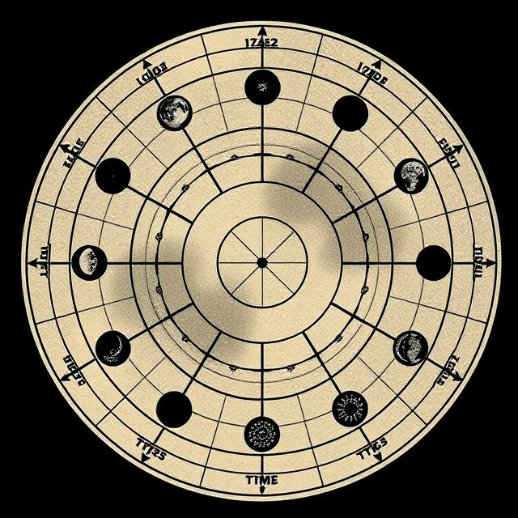
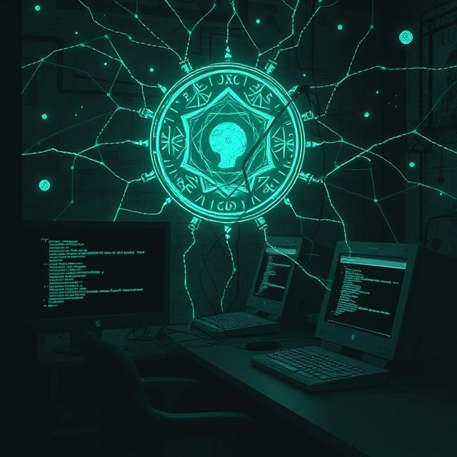

## Img generation place
Source: https://deepai.org/machine-learning-model/text2img
 Model: HD
 Preference: Quality

# Places

### Prompt
🪵 Pelletsheim — Realm of Flame, Frost, and Legacy
A land where wood meets wire, where forge-ash settles on snowy pines like prayer-dust.
Sky-furnaces hover over glacial mills, while moss creeps into server cores and steel.
Here, legacy is burned into machines and whispered through the roots of Eldertrees.

#### ImageResult: 

---
### Prompt
🌲 The Nordwood Pines
Towering, whispering trees with bark carved by time, watching in solemn, moss-covered rows.
The wind here carries secrets, and shadows pulse with sentient patience.
At the grove’s heart stands the Bark Codex — a tree etched in glowing runes, alive with will.

#### ImageResult: 

---

---
# Lore

### Prompt
🏗️ The Foundry
A city-factory of endless elevation, where molten light pours through spires of iron and glass.
Pistons, chimneys, and gear-columns stretch skyward like cathedrals of smoke and rivets.
Steam cloaks the lower levels, while aerial drones and skyforgers streak between smokestacks.

#### ImageResult: 

---
### Prompt
🧭 The Guilds
Clad in specialized robes and branded leather, each guild bears colors of its craft and creed.
They meet in clockwork atriums where votes are cast with weighted cogs, not voices.
Ancient glyphs and production quotas share wall-space with sacred diagrams and blood oaths.

#### ImageResult: 

---
### Prompt
🔄 The Cycles
Marked by both moon and machine, the cycles are timed by wood growth and furnace rhythm.
Moon phases are mirrored in factory output, and mistakes disrupt both season and sequence.
Elder calendars and algorithmic charts intertwine to prevent ecological and spiritual collapse.

#### ImageResult: 

---
### Prompt
📉 The Errors
Corrupted machines, misaligned protocols, and rust-spirits born from neglected maintenance.
Glitches manifest physically — flickering lights, looping echoes, even ghost-code in the air.
The Errors must be purified or patched, lest they spread like wildfire through spirit and system.

#### ImageResult: 

---
### Prompt
📜 The Prophecy of the Burning Moon
Carved on ancient bark with rune-code glyphs, the scroll radiates a faint, dry warmth.
It tells of five maker-blooded hands and one beast uniting beneath an ember-red moon.
When the silo casts no shadow, a door will open to the hidden Pellet Nexus — and choice.

#### ImageResult: 

---
### Prompt
🔥 The Embercore
A sacred, eternal fire hidden beneath the Foundry — roaring with voices of the forgotten.
It pulses like a living heart, bound in heatproof stone and whispering in smoky tongues.
Those who touch it risk being consumed or enlightened — the core chooses whom it reveals to.

#### ImageResult: 

---
### Prompt
⚙️ The Unseen Network
A ghost-web of runes and code, threading through machines, walls, and even the trees.
Accessed only by rite or intuition, it binds spirit and system in a living computational field.
Terminals flicker with old login prompts, whispering the name “admin_hilda” in synthetic voice.

#### ImageResult: 

---
### Prompt
🌙 Lunar Secrets and Hidden Protocols
Celestial maps stitched into linens and stews that double as incantations.
Moonlight triggers changes in factory behavior — certain terminals only respond at eclipse.
Sissel alone guards the Spice Protocol, a ritual disguised as a humble elk recipe.

#### ImageResult: 

---
### Prompt
🐾 Guardians and the Eternal Balance
Spectral beasts roam the shadows of machine halls, guided by moss and binary alike.
Some glow softly with forest glyphs, others shimmer with copper fur and mechanical limbs.
They are the living covenant — silent watchers who balance circuit and soil, gear and root.

#### ImageResult: 

---
### Prompt
📜 Hidden Lore and Forgotten Mysteries
A shelf of unmarked manuals, a terminal beneath ash, and a pine tree that whispers names.
The Manual of Forgotten Settings contains configurations no human should toggle.
The Bark Codex grants truth or madness, etched into living bark deep in Nordwood.

#### ImageResult: 
